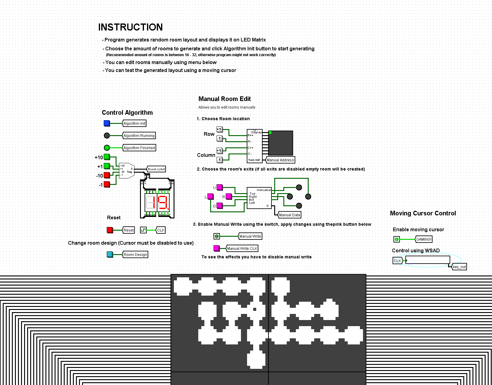

# bit-dungeon
A logic-gate-level 2D dungeon map generator with rudimentary interactivity. 
Implemented in original logisim in 2022 by the owner and two collaborators on this repository.

## Features

- Handwritten randomized room layout generation
- ROM based, customizable room appearance
- Direct layout editing
- Movement around the dungeon with collision
- 64x64 display

## Running

To run this project you need the original [Logisim](https://www.cburch.com/logisim/) software and [Java Runtime Environment](https://www.java.com/download/).

In Logisim choose `File -> Open...` and open `src/Main.circ`. Enable ticks in `Simulation` tab and follow instructions presented as a dashboard above the display.

